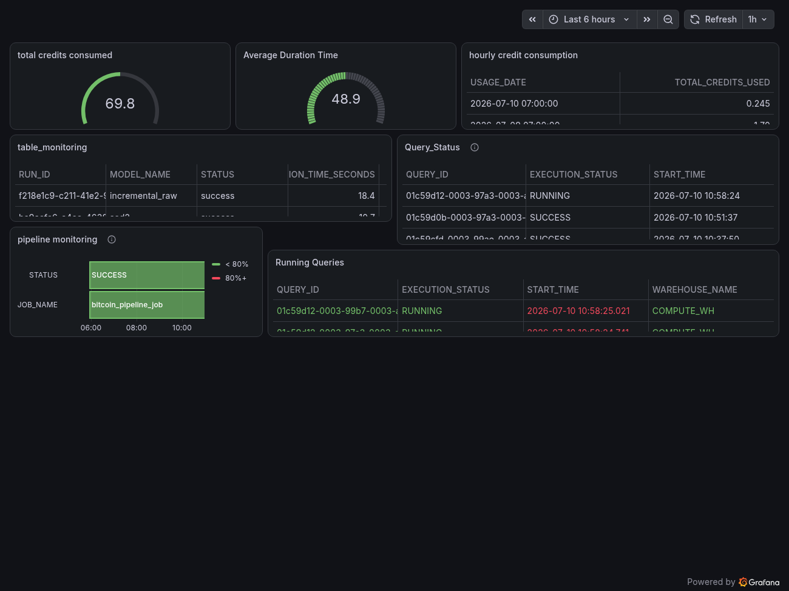

# Bitcoin Market Data Pipeline

A production-grade ELT pipeline that ingests real-time cryptocurrency market data
from CoinGecko, loads it into Snowflake, and transforms it through a dbt medallion
architecture (Bronze → Silver → Gold), orchestrated by Dagster.

## Architecture

CoinGecko API → Dagster → Snowflake RAW → dbt Bronze → dbt Silver → dbt Gold

## Tech Stack

- Python — Ingestion scripting
- CoinGecko API — Real-time crypto market data
- Snowflake — Cloud data warehouse
- dbt — Data transformation (medallion architecture)
- Dagster — Orchestration and scheduling

## Project Structure

bitcoin-market-pipeline/
├── bitcoin_dbt/          # dbt project (bronze/silver/gold)
├── bitcoin_dagster/      # Dagster package
├── .env                  # Secrets (never committed)
├── requirements.txt
└── README.md

## dbt Medallion Architecture

### Bronze
- raw_data — view over raw CoinGecko data
- incremental_raw — incremental load tracking new records

### Silver
- silver_crypto — deduplicates records, casts timestamps
- candles — hourly OHLC candles from SCD2 price history

### Gold
- scd2 — SCD Type 2 incremental price history
- indicators — 10 and 50 period moving averages
- mkt_cap — Top 20 coins by market cap
- trading_signals — BUY/SELL/HOLD signals from MA crossovers

## Setup

1. Clone the repo
   git clone https://github.com/YOUR_USERNAME/bitcoin-market-pipeline.git

2. Create virtual environment
   python3 -m venv venv
   source venv/bin/activate
   pip install -r requirements.txt

3. Create .env file with your Snowflake credentials
   SNOWFLAKE_ACCOUNT=your_account
   SNOWFLAKE_USER=your_user
   SNOWFLAKE_PASSWORD=your_password
   SNOWFLAKE_DATABASE=CRYPTO_DB
   SNOWFLAKE_SCHEMA=RAW
   SNOWFLAKE_WAREHOUSE=CRYPTO_WH
   SNOWFLAKE_ROLE=ACCOUNTADMIN

4. Create Snowflake objects (run in Snowflake worksheet)
   CREATE DATABASE IF NOT EXISTS CRYPTO_DB;
   CREATE SCHEMA IF NOT EXISTS CRYPTO_DB.RAW;
   CREATE SCHEMA IF NOT EXISTS CRYPTO_DB.ANALYTICS;
   CREATE WAREHOUSE IF NOT EXISTS CRYPTO_WH
     WITH WAREHOUSE_SIZE = 'X-SMALL'
     AUTO_SUSPEND = 60
     AUTO_RESUME = TRUE;

5. Install and run
   cd bitcoin_dagster
   pip install -e .
   cd ..
   export $(cat .env | xargs)
   dagster dev -m bitcoin_dagster

   Open http://localhost:3000
## Running the Pipeline

### Option 1 - Launch script (recommended)
   bash start.sh

### Option 2 - Manual
   export $(cat .env | xargs)
   dagster dev -m bitcoin_dagster

## Data Tests

All layers have dbt schema tests:
- Bronze: unique and not_null on id
- Silver: not_null on id, candle_time
- Gold: not_null on id, accepted_values on signal (BUY/SELL/HOLD)
- Source: freshness check on CRYPTO_MARKET_RAW (warn: 1h, error: 6h)

## Incremental Models

Two models use incremental materialisation with merge strategy:
- incremental_raw (Bronze) — appends new raw records
- scd2 (Gold) — tracks price changes as SCD Type 2 history

## Snowflake Monitoring

Two monitoring views created in CRYPTO_DB.ANALYTICS:
- warehouse_monitoring — hourly credit usage per warehouse
- query_monitoring — last 7 days query history with cost

## Dependencies

- dagster
- dagster-dbt
- dagster-snowflake
- dagster-aws
- dbt-snowflake
- snowflake-connector-python
- pandas
- requests
- python-dotenv

## Deployment

Supports Dagster Cloud hybrid deployment via dagster_cloud.yaml.
The hybrid agent runs on your local Ubuntu machine while
orchestration is managed by Dagster Cloud (ifistic.dagster.plus).
## Schedule

The pipeline runs every hour via bitcoin_hourly_schedule.
Enable it in the Dagster UI under Schedules.
## Monitoring

Live pipeline health and SCD2 model activity tracked via Grafana Cloud:

## Author

Ifiok Udoh — Data Engineer
